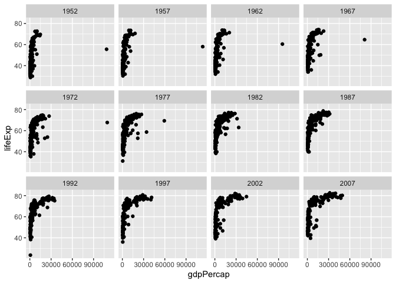

# Class 5: Data visualization with ggplot
Justin Lu (PID: A16318305)

- [A more complicated scatter plot](#a-more-complicated-scatter-plot)
- [Exploring the gapminder dataset](#exploring-the-gapminder-dataset)

Today we will have our first play with the \*ggplot2\*\* package - one
of the most popular graphics packages on the planet.

There are many plotting systems in R. These include so-called *“base”*
plotting/graphics.

``` r
plot(cars)
```


Base plot is generally rather short code annd somewhat dull plots - but
it is always there for you and is really fast for big datasets

If I want to use **ggplot2** it takes some more work.

``` r
#ggplot(cars)
```

I need to install the package first to my computer. To do this I can use
the function `install.packages()` but install packages should always be
done in the console and not in running code.

Every time I want to use a package I need to load it up with a
`library()` call

``` r
#install.packages("ggplot2") is done in the console
library(ggplot2)
```

Now finally I can use the ggplot

``` r
ggplot(cars) 
```


Every ggplot has at least 3 things:

- **data** (the data.frame with the data you want to plot)
- **aes** (the aesthetics mapping of the data to the plot)
- **geom** (how do you want the plot to look, points, lines, columns,
  etc.)

``` r
ggplot(cars) + aes (x=speed, y = dist) + geom_point() + geom_smooth()
```

    `geom_smooth()` using method = 'loess' and formula = 'y ~ x'


I want a linear model and no standard error bounds shown on my plot. I
also want nicer axis labels, a tittle, etc.

``` r
bp <- ggplot(cars) + aes (x=speed, y = dist) + geom_point()
```

``` r
bp + geom_smooth(se = FALSE, method ="lm") + labs(title = "Stopping Distance of Old Cars", x = "Speed (MPH)", y= "Distance (ft)", caption = "From the Cars dataset") + theme_bw()
```

    `geom_smooth()` using formula = 'y ~ x'


## A more complicated scatter plot

Here we make a plot of gene expression data:

``` r
url <- "https://bioboot.github.io/bimm143_S20/class-material/up_down_expression.txt"
genes <- read.delim(url)
head(genes)
```

            Gene Condition1 Condition2      State
    1      A4GNT -3.6808610 -3.4401355 unchanging
    2       AAAS  4.5479580  4.3864126 unchanging
    3      AASDH  3.7190695  3.4787276 unchanging
    4       AATF  5.0784720  5.0151916 unchanging
    5       AATK  0.4711421  0.5598642 unchanging
    6 AB015752.4 -3.6808610 -3.5921390 unchanging

``` r
nrow(genes)
```

    [1] 5196

``` r
ncol(genes)
```

    [1] 4

``` r
table(genes$State)
```


          down unchanging         up 
            72       4997        127 

``` r
round(sum(genes$State == "up") / nrow(genes) * 100,2)
```

    [1] 2.44

``` r
p <- ggplot(genes) + aes(x = Condition1, y = Condition2, col = State) + geom_point()
```

``` r
p + scale_colour_manual( values=c("blue","gray","red") ) +  labs(title = "Gene Expression Changes Upon Drug Treatment", x = "Control (no drug)", y = "Drug Treatment")
```


## Exploring the gapminder dataset

Here we will load up the gapminder dataset to get practice with
different aes mapping

``` r
url <- "https://raw.githubusercontent.com/jennybc/gapminder/master/inst/extdata/gapminder.tsv"

gapminder <- read.delim(url)
```

How many entries rows are in this dataset?

``` r
nrow(gapminder)
```

    [1] 1704

``` r
head(gapminder)
```

          country continent year lifeExp      pop gdpPercap
    1 Afghanistan      Asia 1952  28.801  8425333  779.4453
    2 Afghanistan      Asia 1957  30.332  9240934  820.8530
    3 Afghanistan      Asia 1962  31.997 10267083  853.1007
    4 Afghanistan      Asia 1967  34.020 11537966  836.1971
    5 Afghanistan      Asia 1972  36.088 13079460  739.9811
    6 Afghanistan      Asia 1977  38.438 14880372  786.1134

``` r
table(gapminder$year)
```


    1952 1957 1962 1967 1972 1977 1982 1987 1992 1997 2002 2007 
     142  142  142  142  142  142  142  142  142  142  142  142 

> Q. How many continents?

``` r
table(gapminder$continent)
```


      Africa Americas     Asia   Europe  Oceania 
         624      300      396      360       24 

I could use the `unique()` function…

``` r
unique(gapminder$continent)
```

    [1] "Asia"     "Europe"   "Africa"   "Americas" "Oceania" 

``` r
length(unique(gapminder$continent))
```

    [1] 5

> Q. How many countries?

``` r
length(unique(gapminder$country))
```

    [1] 142

``` r
ggplot(gapminder) + aes(x = gdpPercap, y = lifeExp) + geom_point(col = "blue")
```


``` r
library (dplyr)
```


    Attaching package: 'dplyr'

    The following objects are masked from 'package:stats':

        filter, lag

    The following objects are masked from 'package:base':

        intersect, setdiff, setequal, union

``` r
gapminder_2007 <- filter(gapminder, year == 2007)
head(gapminder_2007)
```

          country continent year lifeExp      pop  gdpPercap
    1 Afghanistan      Asia 2007  43.828 31889923   974.5803
    2     Albania    Europe 2007  76.423  3600523  5937.0295
    3     Algeria    Africa 2007  72.301 33333216  6223.3675
    4      Angola    Africa 2007  42.731 12420476  4797.2313
    5   Argentina  Americas 2007  75.320 40301927 12779.3796
    6   Australia   Oceania 2007  81.235 20434176 34435.3674

Plot of 2007 with population and continent data

``` r
ggplot(gapminder_2007) + aes(x= gdpPercap, y= lifeExp, col = continent, size = pop) + geom_point(alpha = 0.4)
```


``` r
ggplot(gapminder) + aes (x = gdpPercap, y = lifeExp) + geom_point() + facet_wrap(~year)
```


